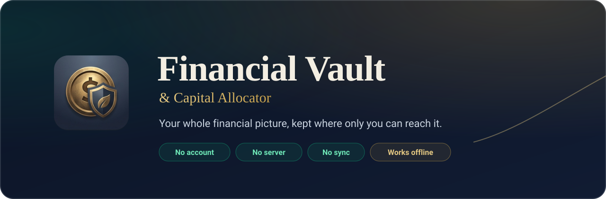
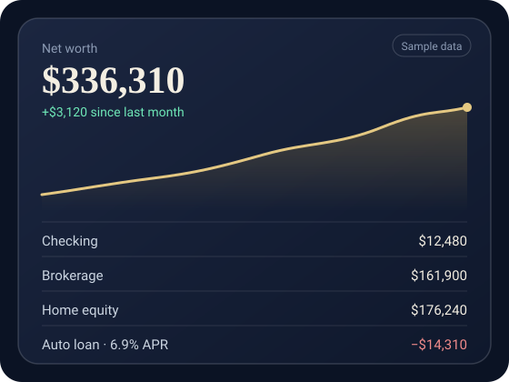
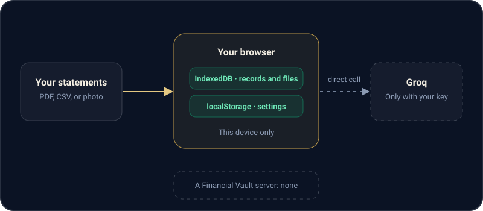

<div align="center">



<br>

**A local-first net worth tracker, budget, and estate continuity plan.**<br>
Drop in a statement. Watch your picture build itself. Keep every byte on your own device.

<br>

[](https://johnlaz.github.io/wealth/app/)
[](https://johnlaz.github.io/wealth/)


[Why](#why-it-exists) · [Features](#what-it-does) · [Privacy](#your-data-never-leaves-your-device) · [AI](#ai-is-optional-and-its-yours) · [Install](#install-it-like-an-app) · [Fine print](#what-to-know-before-you-rely-on-it) · [Run it](#run-it-yourself)

</div>

<br>

## Why it exists

Most budgeting apps want your bank credentials, your email, and a subscription. **Financial Vault wants none of that.** It is a single self-contained web app with no server, no sign-up, and no sync. It turns your statements into a living net worth tracker, a real monthly budget, and a plan someone else could actually follow if they had to step in for you.

Host it on GitHub Pages, install it on your phone's home screen, and it works online or off.

<div align="center">

<br>
<sub>The net worth view, shown with sample data.</sub>
</div>

<br>

## What it does

<table>
<tr>
<td width="50%" valign="top">

### 🏦 Asset & Liability Vault
Drag in a statement as a PDF, CSV, or photo. The vault reads the institution, account type, balance, APR, and the statement's real as-of date, then asks you to **confirm before saving**. Every upload stays stored and viewable, and accounts flag themselves when a statement goes stale.

</td>
<td width="50%" valign="top">

### 💸 Budget & Expenses
Recurring bills with real due dates, categories that fill in as you type, and a running view of what's due soon. Recurring charges found in statements are offered for one-click adding. You can also **import a budget spreadsheet or raw bank export** and confirm what it finds.

</td>
</tr>
<tr>
<td width="50%" valign="top">

### 📈 Strategic Capital Allocation
A deterministic, always-on read of your numbers: which debts cost you the most in APR, and how much idle cash is sitting in low-yield accounts. **No AI involved**, just math on your own data.

</td>
<td width="50%" valign="top">

### 🎯 Goals
Savings targets and debt payoff goals. Link a goal to an account and progress follows its balance as new statements arrive, or update it by hand. With some history, you get a **projected completion date** from the recent trend.

</td>
</tr>
<tr>
<td width="50%" valign="top">

### 🧠 Wealth Strategy & Advisor Chat
With your own Groq key, generate a report on your full picture: strengths, risks, and a prioritized list of strategies to consider. Export it to PDF, then **ask follow-up questions** grounded in your real balances.

</td>
<td width="50%" valign="top">

### 🛟 Continuity Plan
The feature every budgeting app skips. Key contacts (attorney, CPA, advisor), per-account notes, and handoff instructions, plus a **readiness checklist** that tells you honestly whether someone could pick this up tomorrow. One click compiles a settlement-ready PDF.

</td>
</tr>
</table>

**📉 Net worth, tracked automatically.** Each time you open the vault it snapshots your net worth, and per-account balances build their own trend history. The line moves without you doing anything extra.

<br>

## Your data never leaves your device

There is no backend. No account. No cloud sync. Every account, document, expense, contact, and note lives in your browser's IndexedDB and localStorage, and nowhere else.

<div align="center">

</div>

<br>

| | |
|---|---|
| **No account to create or leak** | Open the app and start. There's no login database holding your name beside your balances. |
| **AI sees statement text only if you allow it** | Without a Groq key, parsing runs on rules in your browser. With one, the call goes straight from your browser to Groq. |
| **Backups are yours to keep** | **Settings → Export Complete Backup** writes one `.json` file with everything in it. The app nudges you when your last backup gets old. |

> [!IMPORTANT]
> Because nothing syncs, **your backup file is your only recovery plan.** Clearing your browser data or losing the device without an export means losing the vault. Treat the export like a password manager backup.

<br>

## AI is optional, and it's yours

The core app is complete without it. Add a [Groq API key](https://console.groq.com/keys) in **Settings** and parsing, recurring-charge detection, and the strategy report get smarter.

| Without a key | With your Groq key |
|---|---|
| Rule-based statement parsing | Better classification and recurring-charge detection |
| Full vault, budget, goals, and continuity plan | Photo statements through a vision model |
| Strategic allocation, identical to the keyed version | Wealth strategy report and advisor chat |
| Nothing ever leaves your device | Called directly from your browser, on your account |

Model lineups change often. Rather than hard-coding names that go stale, Settings has a **Fetch Models** button that asks *your* Groq account what it can use. Pick a text model, and a vision model if you want photo statements.

<br>

## Install it like an app

A full Progressive Web App. Installed, it opens in its own window with its own icon, and a service worker keeps the app shell available with no connection.

| Where | How |
|---|---|
| 🖥 **Desktop** (Chrome, Edge) | Click the install icon in the address bar, or use the in-app **Install App** button |
| 📱 **iPhone / iPad** (Safari) | **Share → Add to Home Screen** |
| 🤖 **Android** (Chrome) | Tap the in-app **Install App** button, or **Menu → Install app** |

<br>

## What to know before you rely on it

- **Back it up yourself.** See the note above. This is the price of true privacy.
- **The PIN lock is a lock screen, not encryption.** It gates the app on a device but does not encrypt what the browser stores. Use your device's own protections too.
- **Check what the parser extracts.** Statement parsing, AI or rule-based, can make mistakes. Confirm figures before saving.
- **Not financial, legal, or tax advice.** The strategy report and allocation suggestions come from the numbers you enter. They support your record-keeping and are no substitute for a licensed professional.

<br>

## Tech stack

| Layer | Choice |
|---|---|
| UI | React 18 via CDN, in-browser Babel. No build step |
| Styling | Tailwind CSS |
| Storage | IndexedDB (accounts, documents, expenses, contacts, goals, history) and localStorage (settings) |
| Statement parsing | pdf.js and PapaParse, with optional Groq LLM extraction |
| Spreadsheet import | SheetJS |
| PDF export | jsPDF |
| Icons | Lucide |
| Hosting | Static. GitHub Pages or any static host |

No npm install, no build pipeline, no framework version drift. Open the app's `index.html` and it runs.

<br>

## Run it yourself

```bash
git clone https://github.com/johnlaz/wealth.git
cd wealth
# Serve the folder with any static server, for example:
python3 -m http.server 8080
# then open http://localhost:8080/
```

Service workers and installability need `http://localhost` or HTTPS, so serving the folder beats double-clicking `index.html`.

### Project layout

```text
wealth/
├── index.html        Landing page (the website)
├── sw.js             Retires the pre-/app service worker on old installs
├── assets/           README graphics
├── README.md
└── app/              The Financial Vault PWA
    ├── index.html    The whole app
    ├── manifest.json
    ├── sw.js         Offline app shell (cache: finvault-v24)
    └── *.png, *.ico  App and favicon icons
```

### Deploy to GitHub Pages

Push the repo and enable Pages on the branch root. The landing page is served at the root and the app at `/app/`. Every path is relative, so it works from a repo subpath as well.

### Add AI parsing

Open the app, go to **Settings**, paste a [Groq API key](https://console.groq.com/keys), choose **Fetch Models**, and pick a text model (and a vision model for photo statements).

<br>

## Disclaimer

This tool is for personal record-keeping and organization. Nothing it produces is financial, legal, or tax advice. Always verify extracted figures before relying on them.

## License

MIT. Do what you want with it.

<div align="center">
<br>
<sub>Built by <b>LAZLAB Creations</b></sub>
</div>
